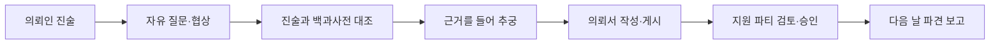

<div align="center">

# HELP WANTED

### AI 의뢰인 × 서류 대조 × 판타지 길드 접수

**말을 숨기거나 잘못 알고 있는 의뢰인을 심문하고,<br>
당신이 작성한 의뢰서만 믿고 떠나는 모험가의 생사를 책임지세요.**

[게임 플레이](https://minsu42.github.io/help-wanted/) · [게임 기획서](design/gdd/game-concept.md) · [NAN 2026 시장조사](design/research/nan2026-market-2026-08-10.md)

`NAN 2026 Game AI Hackathon 예선 출품작`

</div>

---

## 게임 소개

플레이어는 왕립 모험가 길드의 신입 접수원입니다. 의뢰인의 자유로운 진술에서 사실과 추측을 구분하고, 길드 백과사전과 대조해 모순을 찾아야 합니다. 확인한 정보로 의뢰서를 작성하면 모험가 파티들이 그 문서만 보고 지원합니다.

잘 쓴 한 줄은 모험가를 살리고, 놓친 한 줄은 유서가 됩니다.

| 심문 | 조사 | 책임 |
|:---:|:---:|:---:|
| 자연어로 질문·추궁·협상 | 진술 쪽지와 백과사전 대조 | 의뢰서 작성 후 지원 파티 승인 |
| 의뢰인은 기억·오해·비밀을 유지 | 괴물의 크기·흔적·약점과 길드 규정 탐색 | 정보와 준비에 따라 파견 결과 변화 |

## 핵심 플레이 흐름



- 서로 다른 진실성 구조를 가진 의뢰인 6명
- 태그로 탐색하는 실물형 길드 백과사전
- 최근 대화와 전체 대화 장부를 분리한 고정 화면
- 위험 등급·준비·보수에 반응하는 파티 지원 시스템
- 하루가 지나야 확인할 수 있는 파견 결과와 신규 공문
- Web Audio로 생성되는 배경음과 책장·종이·도장 효과음

## AI가 하는 일

AI는 게임의 판정자가 아니라 **의뢰인을 연기하는 에이전트**입니다.

| AI 의뢰인 에이전트 | TypeScript 규칙 엔진 |
|---|---|
| 플레이어의 자연어 의도와 말투 해석 | 공개 가능한 사실과 유효한 근거 검증 |
| 이전 대화와 감정 상태를 유지한 답변 | 인내·경계·보수 변화 계산 |
| 기억·오해·은폐 목적에 맞는 캐릭터 연기 | 의뢰서 품질·파티 지원·생환 결과 판정 |

브라우저는 OpenAI API를 직접 호출하지 않습니다. Cloudflare Worker가 API 키를 보관하고, `/interpret`와 `/respond`를 분리해 AI가 임의로 게임 상태를 바꾸지 못하도록 제한합니다.

## 로컬 실행

요구 환경: Node.js 24, npm 11

```bash
npm install
npm run dev
```

기본 개발 모드는 OpenAI 호출 없이 규칙 기반 시뮬레이터로 실행됩니다. 실제 AI Worker를 연결하려면 `.env.example`을 `.env.local`로 복사하고 주소를 설정하세요.

```env
VITE_AGENT_ENDPOINT=https://help-wanted-intake.nan2026.workers.dev
```

전체 검증:

```bash
npm run check
```

`typecheck → test → production build → bundle size` 순서로 검사합니다.

## AI Worker 배포

API 키를 소스나 GitHub Pages에 넣지 마세요. 반드시 Cloudflare Secret으로 등록합니다.

```bash
cd workers/intake-proxy
npx wrangler secret put LLM_API_KEY
npx wrangler deploy
```

Worker 환경과 보안 경계는 [AI Client Agent Worker 안내](workers/intake-proxy/README.md)에 정리되어 있습니다.

## 기술 구성

- TypeScript 5.5 strict
- Vite 7
- DOM + CSS — 게임 엔진과 UI 프레임워크 없음
- Vitest + happy-dom
- OpenAI API + Cloudflare Worker
- GitHub Pages 자동 배포
- Web Audio API 기반 절차적 BGM·효과음

```text
src/domain/        재현 가능한 게임 규칙
src/data/          사건·백과사전·파티 데이터
src/llm/           AI 에이전트 클라이언트와 검증
src/audio/         절차적 배경음과 효과음
src/presentation/  DOM 화면과 스타일
workers/           OpenAI 프록시와 보안 경계
tests/             단위·통합 테스트
```

## 설계 문서

- [게임 콘셉트](design/gdd/game-concept.md)
- [자유 심문 시스템](design/gdd/intake-dialogue.md)
- [AI 의뢰인 에이전트](design/gdd/ai-client-agent.md)
- [의뢰서와 파티 인계](design/gdd/commission-dispatch.md)
- [시스템 인덱스](design/gdd/systems-index.md)
- [UX 플로우](design/ux/counter-casework-flow.md)
- [제작 로드맵](production/roadmap.md)

---

<div align="center">

**당신이 놓친 한 줄이 모험가의 유서가 됩니다.**

</div>
