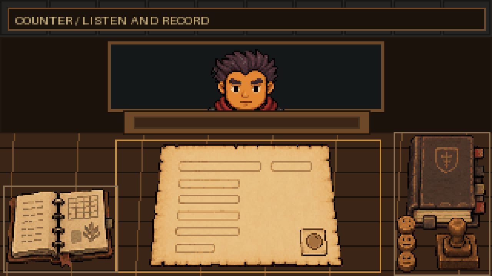
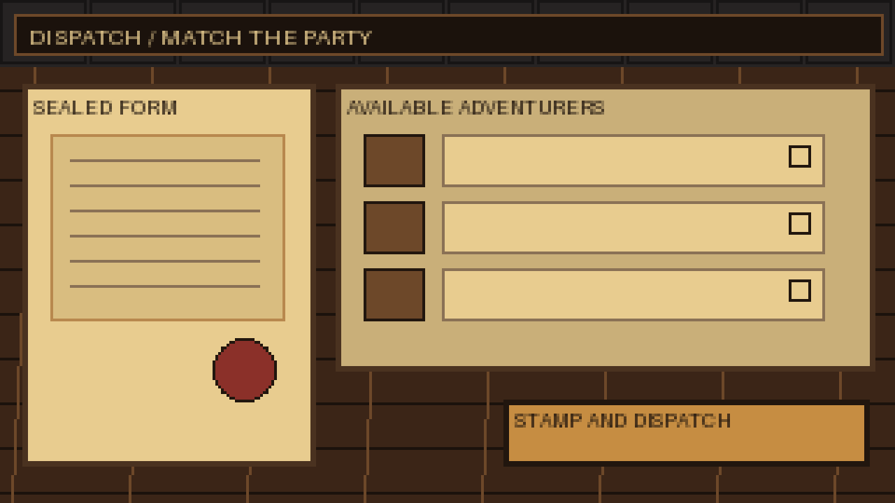
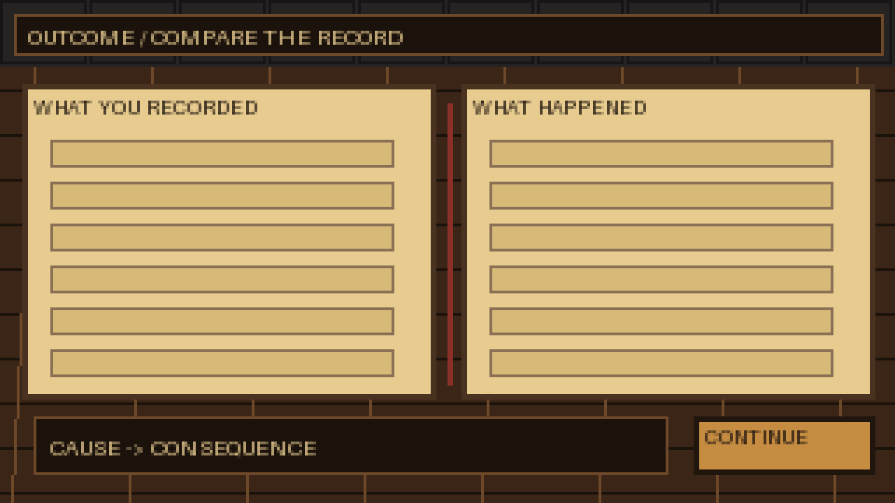
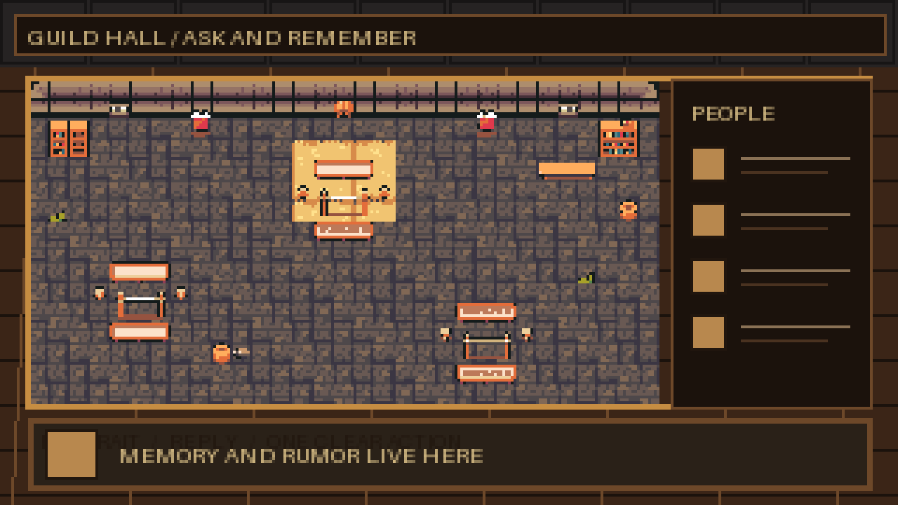
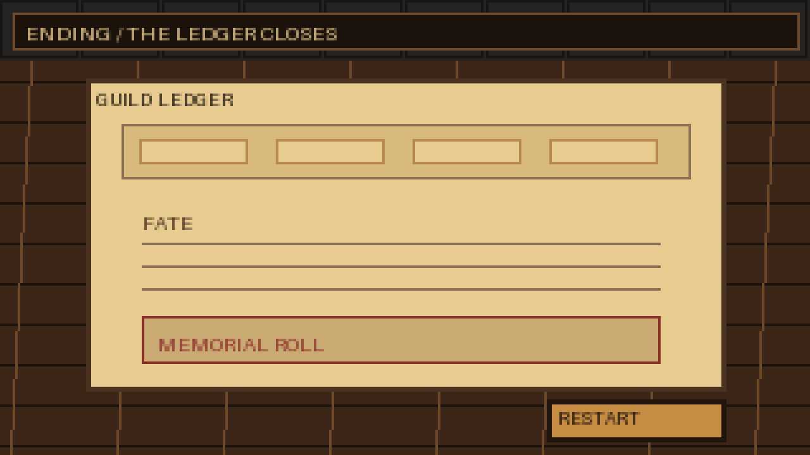

# Submission Screen Wireframes v1

**Status:** Locked for implementation  
**Date:** 2026-08-10  
**Frame:** 1280×720 output from a 320×180 logical grid, 4× nearest-neighbor

이 문서는 창구 밖 화면에서 새 아트를 무제한 요청하지 않도록 각 화면의 정보 위계와
재사용 자산을 잠근다. 와이어프레임의 영문은 구조 표식이며 런타임 문구가 아니다.

## Counter

- 중앙 의뢰서가 유일한 주 작업면이다.
- 수첩은 좌측, 길드마스터북·응대 기록·단일 도장은 우측 도구 영역에 고정한다.
- 의뢰인 반응은 상단 창구, 한 줄 대사는 창틀 바로 아래에서 읽는다.
- **재사용:** 의뢰인 표정 시트, 네 개 책상 오브젝트, 목재/석재 팔레트, DOM 텍스트.

## Dispatch

- 왼쪽은 봉인 직전 의뢰서, 오른쪽은 모험가 목록이다.
- 모험가 선택은 행 전체와 체크 모양으로 표시해 색에만 의존하지 않는다.
- 기본 초점은 첫 가용 모험가, 이후 목록 아래의 파견 버튼으로 이동한다.
- **재사용:** 의뢰서, 봉랍 자국, `cast-sprites.png`, 나무 버튼 3상태.

## Outcome

- `내가 기록한 것`과 `실제 결과`를 같은 폭으로 나란히 둔다.
- 차이는 행 위치와 굵기/테두리로 먼저 읽히며, 붉은색은 사망·은폐 경고에만 쓴다.
- **재사용:** 의뢰서 재질, 도장 자국, 인물 스프라이트/초상, 나무 버튼.

## Guild Hall

- 기존 `hall-room.png`를 주 장면으로 유지하고 우측에 인물/소문 목록을 둔다.
- 하단 대화 프레임은 선택된 인물의 초상·답변·주 행동 하나만 보여준다.
- 기본 초점은 방 안 첫 인물이며 목록과 하단 행동까지 명시적 순서로 연결한다.
- **재사용:** `hall-room.png`, 캐스트 아틀라스, 기존 9-slice 패널/버튼.

## Ending

- 한 권의 길드 장부로 요약·운명·추모 명단을 묶는다.
- 재시작은 화면의 마지막이자 유일한 주 행동이다.
- **재사용:** 의뢰서/장부 종이 재질, 봉랍색, 캐스트 초상, 나무 버튼.

## Responsive and input lock

- 16:9에서는 320×180 전체를 정수 확대한다.
- 세로 화면에서는 장면을 자르지 않고 문서/목록을 세로 흐름으로 재배치한다.
- 장식은 가장자리까지 갈 수 있지만 텍스트와 행동은 16 논리 픽셀 안전 영역 안에 둔다.
- 모든 화면에 초기 키보드 초점, 명시적 이동 순서, hover와 구분되는 focus-visible 상태를 둔다.
- 동적 한글은 DOM 텍스트로 유지하고 이미지에 굽지 않는다.

